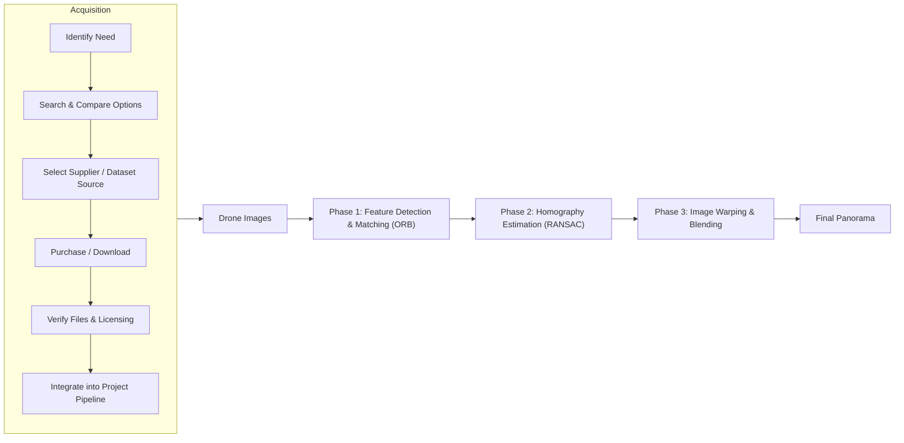
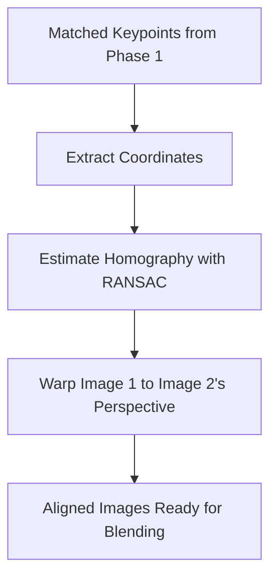
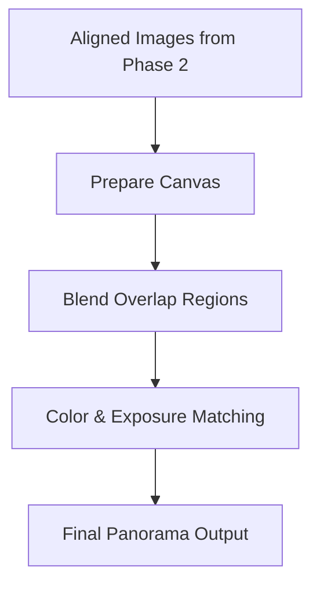

# Drone Panorama Stitching (CV Final Project)

This project stitches overlapping drone images into a seamless panorama using feature matching, RANSAC, and warping techniques.
## Project Pipelines

### 🛰 Panorama Stitching Pipeline

### 🛰 Panorama Stitching Pipeline



## Phase 1 — ORB Feature Detection & Matching

The goal of Phase 1 is to find visual “landmarks” that appear in both drone images so we can align them into a panorama.

**Steps:**
1. **Load & Preprocess** — Convert both images to grayscale for feature detection.
2. **Detect Keypoints (ORB)** — Identify distinctive points like runway markings or building corners.
3. **Match Descriptors** — Compare feature fingerprints between images using a brute-force matcher.
4. **Sort & Visualize** — Draw the top matches and save them to `output/matches.jpg`.

These matched points are the “anchor points” we’ll use in Phase 2 to calculate the homography and align the images.
## Phase 2 — Homography Estimation & Image Alignment

In Phase 2, we take the matched keypoints from Phase 1 and compute a **homography matrix** — a mathematical transformation that maps one image’s perspective onto the other.

**Steps:**
1. **Extract Matched Points** — Get the (x, y) coordinates of each matched keypoint in both images.
2. **Estimate Homography (RANSAC)** — Use Random Sample Consensus to find the best-fit transformation while ignoring outliers.
3. **Warp Image** — Apply the homography to warp one image into the other’s perspective.
4. **Save Aligned Output** — Store the aligned image as `output/aligned.jpg` for Phase 3 blending.

### 📊 Visual Flow


## Phase 3 — Image Warping & Blending

In Phase 3, we take the aligned images from Phase 2 and blend them into a seamless panorama.

**Steps:**
1. **Prepare Canvas** — Create an output canvas large enough to hold both warped and base images.
2. **Blend Overlap Regions** — Use blending techniques to smooth transitions:
    - **Feathering** — Gradually fade between images in the overlap.
    - **Multi-band blending** — Blend at multiple frequency levels for smoother results.
3. **Color & Exposure Matching** — Adjust brightness, contrast, and color balance to ensure consistency.
4. **Save Final Panorama** — Export the stitched image as `output/panorama.jpg`.

### 📊 Visual Flow

## Tools
- Python 3.11
- OpenCV
- IntelliJ IDEA

## Structure
- `data/`: input drone images
- `modules/`: feature matching, homography, stitching
- `output/`: final panoramas
- `main.py`: pipeline entry point

## How to Run
```bash
python main.py
